# FormSG Demo on Fly.io

A demonstration deployment of [FormSG](https://github.com/opengovsg/FormSG) (Singapore's government digital form builder) running on the Fly.io platform.

**🔗 Live Demo**: [https://form.demos.sg](https://form.demos.sg)

## Overview

This repository contains customizations and configuration to deploy FormSG as a public demo. It uses an "overlay" approach - the base FormSG codebase is merged with demo-specific replacements during deployment.

### Why the overlay approach?

The overlay essentially **"de-governments" FormSG** - transforming a Singapore government platform into a generic form builder demo while preserving core functionality.

### The Universal Pattern

While this repository demonstrates deploying FormSG on Fly.io, the overlay deployment pattern is generalizable to other platforms and applications:

**Core Architecture:**
1. **Base + Overlay** - Clone upstream → Apply customizations → Deploy
2. **Platform-agnostic workflow** - `just setup` → edit → test → sync → commit
3. **Smart CI/CD** - Conditional builds based on file changes (code vs config)

**Potential Applications:**
- **formsg-on-railway** - Replace `fly.toml` with Railway config, same Docker approach
- **formsg-on-render** - Adapt to Render's web service deployment model
- **formsg-on-aws** - ECS/Fargate deployment with ALB and RDS
- etc.

**What Makes This Reusable:**
- Dev workflow is infrastructure-agnostic
- `replacements/` directory works for any codebase structure
- CI optimization applies universally
- Could be templated, maybe...?

## Quick Start

### Prerequisites
- [Docker](https://docker.com) for local development
- [Just](https://github.com/casey/just) command runner: `brew install just`

### Local Development
```bash
# Set up demo (one-time)
just setup

# Start the demo
just start

# View logs
just logs

# Stop when done
just stop

# Clean up everything
just clean
```

Run `just --list` to see all available commands.

### Dev Workflow

```mermaid
flowchart TD
    %% Main development cycle
    A["🚀 just setup"] --> B["📝 Edit in .formsg-base/"]
    B --> C["🧪 just start"]
    C --> D{Changes good?}
    D -->|No| B
    D -->|Yes| E["🔄 just sync"]
    E --> F["💾 git commit"]
    F --> G{Continue?}
    G -->|More changes| B
    G -->|Fresh start| A

    style A fill:#e1f5fe
    style E fill:#f3e5f5
    style F fill:#e8f5e8
```



### What's Different in the Demo?
<!-- NOTE: hmm.. should I just remove this section. the replacements folder is already a self=documenting code of what's different -->

The overlay transforms FormSG in several key ways:

**Visual Changes:**
- Adds "SPECIMEN - For Demo Only" watermark across all pages
- Replaces Singapore government masthead with "A product demo from Open Government Products"
- Changes login placeholders from `.gov.sg` to generic email providers
- Swaps Singapore lion icon with simple house icon

**Feature Simplifications:**
- Disables custom logo upload functionality
- Removes image and address field types from form builder
- Strips out multi-language/internationalization features
- Removes enterprise features (status tracking, advanced permissions)
- Limits SingPass authentication to test ID only

**Infrastructure Adaptations:**
- Adds Cloudflare R2 storage support (instead of AWS S3 only)
- Updates Content Security Policy for demo environment
- Forces development mode settings for demo use

### Key Features
- **Public demo** with automated data resets every 3 hours
- **MockPass integration** for testing SingPass/CorpPass authentication
- **Cloudflare R2** for S3-compatible storage
- **Singapore region deployment** on Fly.io
- **Automated CI/CD** with GitHub Actions

## Architecture

### Directory Structure
```
├── replacements/          # Demo-specific file overrides
│   ├── frontend/         # React/TypeScript frontend customizations
│   ├── src/app/          # Node.js/Express backend customizations
│   └── shared/           # Shared constants and utilities
├── scripts/              # Development automation scripts
├── bin/                  # Database reset scripts
├── fly.toml             # Fly.io deployment configuration
├── Dockerfile.demos     # Multi-stage Docker build
└── justfile             # Command runner configuration
```

### Deployment Process
1. **CI triggers** on pushes to main or weekly schedule (Monday 1PM SGT)
2. **Smart filtering** only deploys when relevant files change
3. **Merges** base FormSG with demo replacements
4. **Builds** Docker image and pushes to Fly.io registry
5. **Deploys** to cloud with zero-downtime rolling update

## Contributing

This is a demonstration project. For the main FormSG project, see [opengovsg/FormSG](https://github.com/opengovsg/FormSG).

### Making Changes
1. Edit files in `replacements/` directory
2. Test locally with `just setup && just start`
3. Commit and push - CI will automatically deploy

## License

MIT License - see [LICENSE](LICENSE) file.
